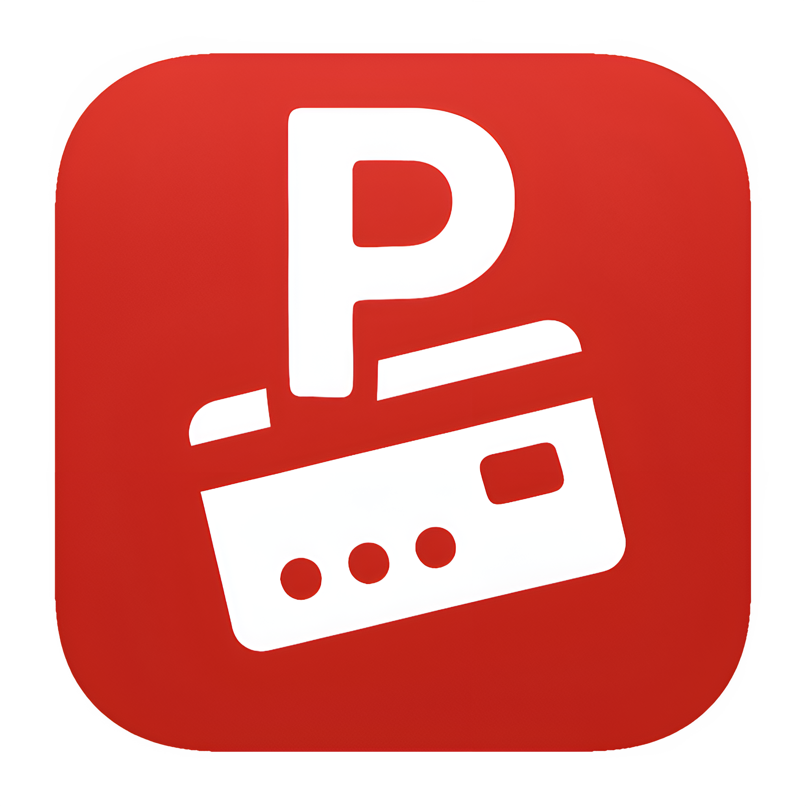

<div align="center">
  
  
  # 🎴 Pockard - Your Digital Wallet for Loyalty Cards
  
  **Never lose a loyalty card again!** Pockard is a modern, privacy-focused Android app that digitizes all your loyalty cards, barcodes, and membership cards into one beautiful, easy-to-use app.
</div>

---

## 💡 Why Another Loyalty Card App?

There are many great loyalty card apps out there - seriously, some are amazing! But they all had one critical missing piece: **device sync without trusting a third party**.

**The Problem**: Existing apps either:
- Store your data on their servers (privacy concerns)
- Don't sync at all (lose everything when switching phones)
- Require cloud subscriptions (ongoing costs)

**The Solution - Pockard**:
- ✅ **Self-Hosted Sync**: Use ANY WebDAV server you control (NAS, VPS, Raspberry Pi, etc.)
  - Why WebDAV? Because it's a standard protocol that works with any server, don't trust my randomly made up authentication/protocol.
- ✅ **Choice to sync or not**: Can be easily used with or without the self-hosted sync server
- ✅ **Open Source Client**: Fully transparent code you can inspect and trust
- ✅ **Easy Family Sharing**: Share cards with family members using the same server
- ✅ **Your Data, Your Rules**: Everything stays on your infrastructure

**TL;DR**: Pockard gives you the convenience of cloud sync with the privacy of local-only apps. Best of both worlds!

---

## ✨ Coolest Features

### 📸 **Smart Scanning**
- **Camera & Image Scanning**: Scan barcodes with your camera or from gallery screenshots - works 100% offline!
- **Manual Entry**: Type in barcode data when scanning isn't an option
- **Auto Logo Search**: Automatically find and add store logos to your cards

### 🎨 **Beautiful & Customizable**
- **3 Stunning Themes**: Light, Dark, and AMOLED Black (pure black for OLED screens)
- **Multiple View Modes**:
  - **List View**: Detailed cards with tags, usage stats, and timestamps
  - **Grid View**: Visual card gallery with customizable columns (1-4)
  - **Minimal View**: Ultra-compact text list for maximum information density
- **Flexible Display**: Pin favorites, hide card names in grid, customize layout

### 🏷️ **Smart Organization**
- **Tags & Filters**: Categorize cards (Shopping, Food, Travel, etc.) and filter instantly
- **Smart Sorting**: By recent use, usage count, name (A-Z), or date added
- **Usage Statistics**: Track which cards you use most, reset stats anytime

### 🌐 **Multi-Language & Accessible**
- **Fully Localized**: Available in English & Hungarian (easily add your own language via `.arb` files)
- **Modern UI**: Material Design 3 with intuitive gestures and quick actions

### ☁️ **Self-Hosted Sync** (The Killer Feature!)
- **Your Data, Your Server**: Sync cards across devices using your own WebDAV server
- **Family Sharing**: Share cards and images with family members using global pools
- **Auto-Sync**: Seamlessly keeps your devices in sync
- **Privacy First**: No third-party cloud, no data collection, open source client

### 🎯 **Power User Features**
- **Image Editor**: Built-in cropping and editing for cover images
- **Auto-Brightness**: Fullscreen barcodes automatically boost brightness for easy scanning
- **Toggle Views**: Switch between barcode and cover image in fullscreen mode
- **100% Offline**: Everything works without internet (except sync)
- **Zero Bloat**: No analytics, no tracking, no ads, no nonsense

---

## 🚀 Quick Start

1. **Download & Install**: Get the APK from releases
2. **Add Your First Card**:
   - Tap the **+** button
   - Choose "Scan Barcode" or "Scan from Image"
   - Add a name and optional tags
   - Save!
3. **Customize**: Go to Settings → Display to pick your theme and layout
4. **Use Your Cards**: Tap any card for a fullscreen barcode ready to scan
5. **(Optional) Set Up Sync**: See the section below to connect your own server

---

## 🔧 Setting Up Self-Hosted Sync

### Server Setup

Pockard uses **WebDAV** protocol, which is supported by many server applications. Here's a minimal setup using **SFTPGo**:

#### Option 1: SFTPGo (Recommended for Beginners)

SFTPGo is a lightweight, easy-to-configure server that supports WebDAV out of the box.

**1. Install SFTPGo** (Docker example):
```bash
docker run -d \
  --name sftpgo \
  -p 8080:8080 \
  -p 8090:8090 \
  -v /path/to/data:/srv/sftpgo/data \
  drakkan/sftpgo
```

**2. Access Web Admin**: Open `http://your-server:8080` in your browser

**3. Create Users**:
- Create separate users for each family member/device (e.g., `user1`, `user2`)
- Set home directories for each user (e.g., `/data/user1`, `/data/user2`)

**4. Enable WebDAV**:
- Go to "Server Management" → enable WebDAV on port 8090
- WebDAV URL will be: `http://your-server:8090`

**5. (Optional) Set Up Global Sharing**:
- Create a shared user (e.g., `family_shared`)
- Add a **Virtual Folder** in each user's profile:
  - Path: `/pockard_global`
  - Maps to: `/data/family_shared/pockard_global`
- This allows all users to access the same global pool!

#### Option 2: Other WebDAV Servers

Any WebDAV-compatible server works:
- **Nextcloud**: Full-featured cloud platform
- **Apache/Nginx with WebDAV module**: For advanced users
- **Synology/QNAP NAS**: Built-in WebDAV support

### Folder Structure

Pockard expects these folders on your WebDAV server:

```
user_home/
├── /cards.json              # Your synced cards (auto-created)
├── /images/                 # Cover images (auto-created)
└── /pockard_global/         # OPTIONAL: Global sharing
    ├── /cards/              # Shared cards
    └── /images/             # Shared images
```

**You don't need to create anything!** Pockard will automatically create the necessary folders when you first connect.

**For Global Sharing**: 
- Only the `/pockard_global` folder needs to be set up (see SFTPGo Virtual Folder example above)
- This folder should be shared across all users who want to share cards/images
- Enable "Global Features" in Pockard's sync settings

### Connecting in Pockard

1. Open **Settings** → **Sync**
2. Tap **"Connect to Server"**
3. Enter:
   - **Server URL**: `http://your-server:8090` (or your WebDAV URL)
   - **Username**: Your SFTPGo username
   - **Password**: Your password
4. Tap **Connect**
5. (Optional) Toggle **"Global Features"** if you set up shared folders

**That's it!** Your cards will now sync automatically.

---

## 📄 License

MIT License - Free and open source!

---

## ⭐ Why Pockard?

- ✅ **100% Privacy**: Your data stays on your device (and optionally your server)
- ✅ **No Subscriptions**: Free and open source
- ✅ **Offline First**: Works without internet
- ✅ **Beautiful Design**: Modern Material Design 3
- ✅ **Self-Hosted Sync**: You control your data
- ✅ **Easy to Use**: Intuitive interface for everyone

**Download today and never dig through your wallet again!** 🎉
